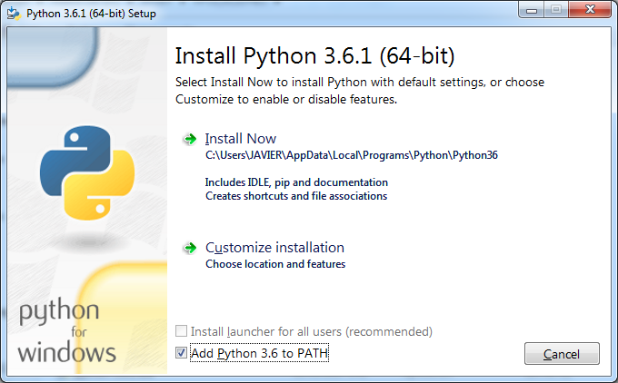
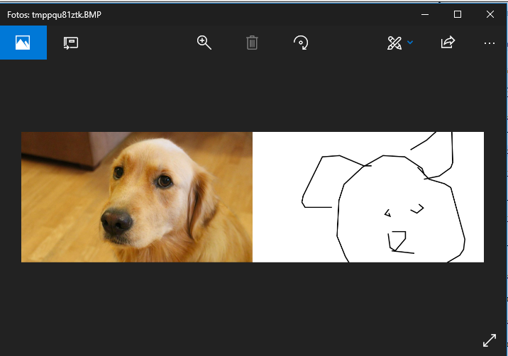
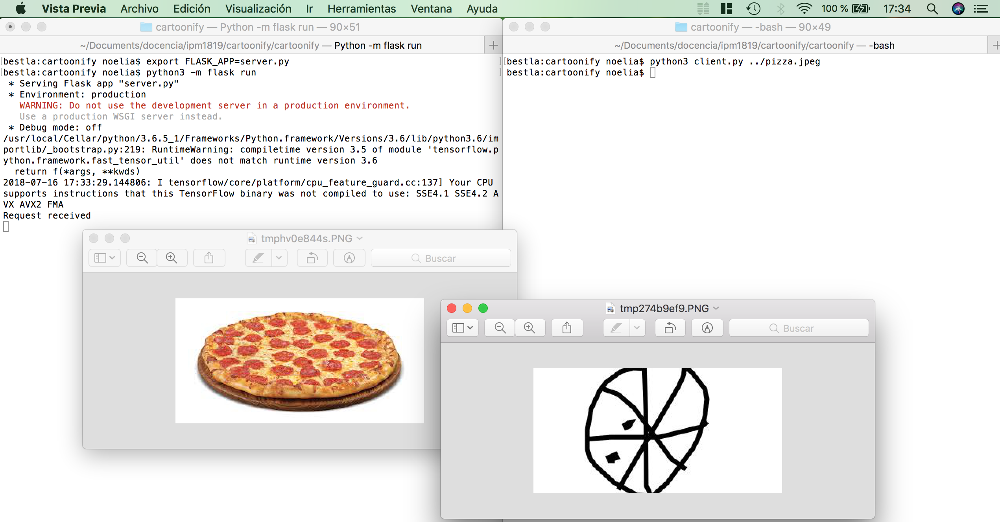

## Cartoonify REST Server

This is a REST server based on the Cartoonify project. The aim of this project is convert photographs into cartoons. First, the main objects of the scene are detected  using a Single Shot Multibox Detector (SSD).  In particular, a MobilenetSSD model was implemented in tensorflow and trained with the Coco dataset.  Then, drawings from the Google QuickDraw dataset are randomly picked to replace the identified objects.

In this fork, as it is intended to run in a desktop computer, all the references to raspberry pi and arduino were removed.

This project contains a REST server written in Flask that exposes only two requests:

- URL:    /cartoon
	- Method: POST
	- Objective: converts the input image into a cartoon
	- Data params: { 'image': 'base64 encoded string with the image data'}
	- Success response: 
		- Code: 200
	  	- Content: { 'cartoon': 'base64 encoded string with the cartoon data'}
	- Error response:
		- Code: 400
		- Content: {'msg': 'cause of the error (Invalid image format/no image was provided)'}

- URL:    /time
	- Method: GET
	- Objective: returns the current time for testing purpouses
	- Data params: None
	- Success response: 
		- Code: 200
	  	- Content: Current time as a string

### Installation

This project was tested on Debian GNU/Linux, Windows 10 Home and macOS High Sierra. The global requirements are:
    
- OS 64 bits (non virtualized)

- Python 3.6

- Gtk3

#### GNU/Linux 64 bits

All the dependencies might have been installed previously in your computer so you only have to run the following commands from terminal:
	 
1. Install project dependencies: 

	`$ pip3 install -r install/requirements_desktop.txt` 

2.  Download the cartoon dataset (~1.4GB) and the tensorflow model (~30MB) by running: 

	`$ python3 install/download_assets.py` 

#### macOS High Sierra 64 bits

Install the main dependencies using [brew](https://brew.sh/). Once you have brew installed in your computer, run the following commands in a terminal:

`$ brew install gtk+3 cairo py3cairo`

The current version of python3 available in brew is 3.7 so, if this version is installed, you have to override it by typing:

`$ brew unlink python`

Then, install python 3.6 using the following formula:

`$ brew install https://raw.githubusercontent.com/Homebrew/homebrew-core/f2a764ef944b1080be64bd88dca9a1d80130c558/Formula/python.rb`

Finally, install the project dependencies, datasets and models:

`$ pip3 install -r install/requirements_desktop.txt` 

`$ python3 install/download_assets.py` 

Note: the python version can be changed with the following command:

`$ brew switch python 3.7.0`

#### Windows 10 64 bits

1. Download and install python 3.6 windows x86_64 web-based installer from [here](https://www.python.org/downloads/release/python-366/).

Important: mark the "Add Python 3.6 to PATH" checkbox in the first step!

To check the installation, open a Windows Command Prompt and type:

`C:\\Users\User> python`

2. Download and install gtk+3 from [here](https://github.com/tschoonj/GTK-for-Windows-Runtime-Environment-Installer). Select the  `gtk3-runtime-XXX-win64.exe` file.

3. Download and install [Visual C++ Redistributable for Visual Studio 2015](https://www.microsoft.com/en-us/download/details.aspx?id=48145)

4. Close the Windows Command Prompt and open it again.

5. Install the project dependencies, datasets and models:

`C:\Users\User> pip install -r install\requirements_desktop.txt` 

`C:\Users\User> python install\download_assets.py`

### Standalone execution
You can run the Cartoonify project in a standalone mode. In the `cartoonify`directory, just execute:

`$ python3 command_line.py path_to_image `

If everything is ok, the original image and its cartoon version will be shown in a window.

### REST server

For running the REST server, create a environment variable for the flask app:

`$ export FLASK_APP=server.py` # GNU/Linux & macOS

`C:\Users\User\cartoonify\cartoonify\> SET FLASK_APP=server.py` # Windows

Run the server with the following command:

`$ python3 -m flask run` # GNU/Linux & macOS

`C:\Users\User\cartoonify\cartoonify\> python -m flask run` # Windows

To shutdown the server, hit Ctrl+C.

### Python client

It was also implemented a client program, written in python, that receives a path to an image as an argument, makes the http request to the flask server and receives the cartoon image. 

In GNU/Linux and macOS, execute in a new terminal:

`$ python3 client.py path_to_image`

In Windows, execute in a new Command prompt:

`C:\Users\User\cartoonify\cartoonify\> python client.py path_to_image`

